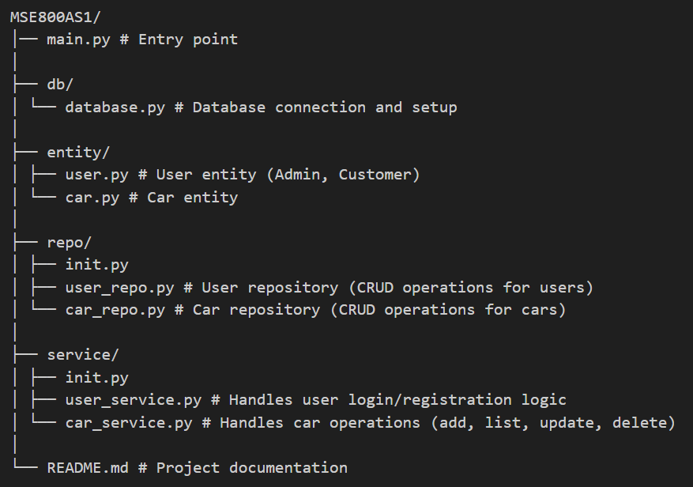

# 🚗 Car Rental Management System

A console-based Python application designed to streamline car rental operations. Built using object-oriented programming principles and a layered architecture, this system supports role-based access for admins and customers, enabling secure and efficient management of vehicles and rental transactions.

---

## 🧱 Project Structure

MSE800AS1/
│── main.py # Entry point
│
├── db/
│ └── database.py # Database connection and setup
│
├── entity/
│ ├── user.py # User entity (Admin, Customer)
│ └── car.py # Car entity
│
├── repo/
│ ├── init.py
│ ├── user_repo.py # User repository (CRUD operations for users)
│ └── car_repo.py # Car repository (CRUD operations for cars)
│
├── service/
│ ├── init.py
│ ├── user_service.py # Handles user login/registration logic
│ └── car_service.py # Handles car operations (add, list, update, delete)
│
└── README.md # Project documentation



---

## ⚙️ Features

### 1. User Management
- User registration and login
- Differentiate between **Admin** and **Customer**
- Role-based privileges

### 2. Car Management
- Admin can **add, update, delete** cars
- Store car details:
  - `id`, `make`, `model`, `year`, `mileage`
  - `available`, `min_rent_days`, `max_rent_days`
  - `daily_rate`

### 3. Rental Booking
- Customers can **view available cars**
- Book cars by selecting rental dates
- System calculates **total rental fee** based on duration and daily rate

### 4. Rental Management
- Admin can **approve/reject rental requests**
- Track ongoing and completed rentals

---

## 🛠️ Installation

1. Clone this repository:
   ```bash
   git clone https://github.com/HasibHasan03/MSE800_ASSIGNMENT1.git
   cd MSE800_ASSIGNMENT1
2. Make sure you have Python 3 installed:

python --version


3. Install dependencies (only sqlite3 needed, which comes with Python):

pip install -r requirements.txt


4. Run the program:

python main.py
